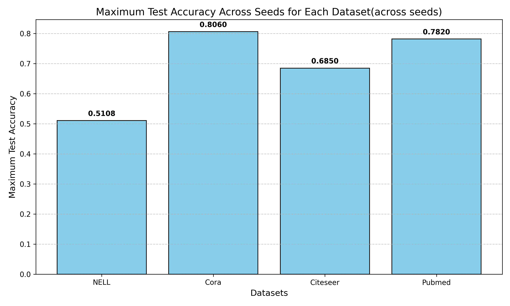

 # Semi-Supervised Classification with Graph Convolutional Networks (GCN)

This repository provides an implementation of **Graph Convolutional Networks (GCNs)** for semi-supervised classification on graph-structured data, as introduced in the paper:  
[Semi-Supervised Classification with Graph Convolutional Networks](https://doi.org/10.48550/arXiv.1609.02907)  
by Thomas N. Kipf and Max Welling.

---

## 📚 Paper Overview

GCNs provide an efficient way to perform convolutional operations directly on graphs, enabling semi-supervised learning by leveraging both the graph structure and node features. Key contributions of the paper include:
- **Localized spectral graph convolutions**: A first-order approximation for efficient computation.
- **Linear scalability**: The method scales linearly with the number of graph edges.
- **Improved performance**: Demonstrates state-of-the-art results on several benchmark datasets.

---

## 🚀 Features

- **End-to-end training**: Combines node features and graph structure in a unified framework.
- **Scalable**: Scales linearly with graph size, making it suitable for large graphs.
- **Generalizable**: Applicable to various graph-based tasks, including node classification and link prediction.

---

## 📂 Datasets

The implementation supports experiments on common benchmark datasets:
1. **Cora**: A citation network dataset where nodes represent papers and edges represent citations.
2. **Citeseer**: Another citation network dataset.
3. **PubMed**: A larger citation network dataset with labeled documents.

These datasets are automatically downloaded and preprocessed for use.

---

## 🛠 Libraries and Tools

The following tools and libraries are used in this implementation:
- [Python 3.8+](https://www.python.org/)
- [PyTorch](https://pytorch.org/)
- [PyTorch Geometric](https://pytorch-geometric.readthedocs.io/)
- [NumPy](https://numpy.org/)
- [SciPy](https://scipy.org/) (for sparse matrix operations)

## 📊 Results

